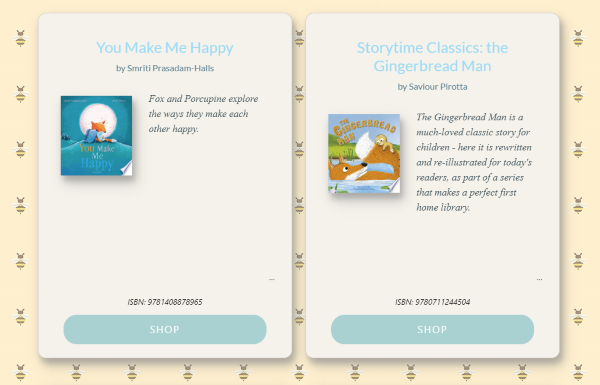

 

# BeeBooks
 ## Table Of Contents
  - [Description](#description)
  - [Installation](#installation)
  - [User-Story](#user-story)
  - [Usage](#usage)
  - [Road-Map](#road-map)
  - [Demo](#demo)
  - [Technologies-Used](#technologies-used)
  - [Credits](#credits)
  - [License](#license)

--- 

## Description
BeeBooks is a children's book search app, designed to empower children and their parents to discover and explore a wide range of captivating books tailored to young readers. The app aims to provide an engaging and user-friendly experience that encourages reading, sparks imagination, and fosters a lifelong love for books. 
It creates a gateway to a world of enchanting stories and literary adventures.

--- 

## Installation
 
- Link to deployed website:  https://beebooks.netlify.app/ 
 
---

## User Story 
- As a user, I want to see a search bar prominently displayed on the homepage, so I can easily start looking for books.
- As a user, I want each book displayed with an eye-catching cover image, title, author, and a brief description.
- As a user, I want the app to be user-friendly, with simple navigation and clear instructions.

---

## Usage
- A prominent search bar allows users to easily find children's books by title, author, or keywords.

- Provide comprehensive book information, including cover images, titles and authors. 

- Design an intuitive and visually appealing interface with colourful and child-friendly aesthetics.
- Ensure seamless navigation, clear instructions and responsive design across various devices.

- The web app contains three page - Home, About and Contact.
- Email JS was used to build the contact form.

---

## Road Map
- Allow users to store wishlist books and to create personal reading lists.
- Browse children's books by categories, genres, age ranges, and themes, enabling users to explore specific interests and preferences.
- Sort books by relevance, rating, or release date to help users find the most suitable options.
- Enable users to access reader reviews and ratings for each book, promoting informed decision-making and community interaction.

## Demo
;

---

## Technologies Used
- React Js
- Node Js
- Google Book API
- Netlify
- Email JS /POST
- Axios /GET
- React-Bootstrap & Bootstrap 5
- React-Icons Library

---

## Credits
- John Walton
- Lubomila Lozanova
- Max Sparrey

---

## License
forestDean/BeeBooks is licensed under the
MIT License
A short and simple permissive license with conditions only requiring preservation of copyright and license notices. Licensed works, modifications, and larger works may be distributed under different terms and without source code.

